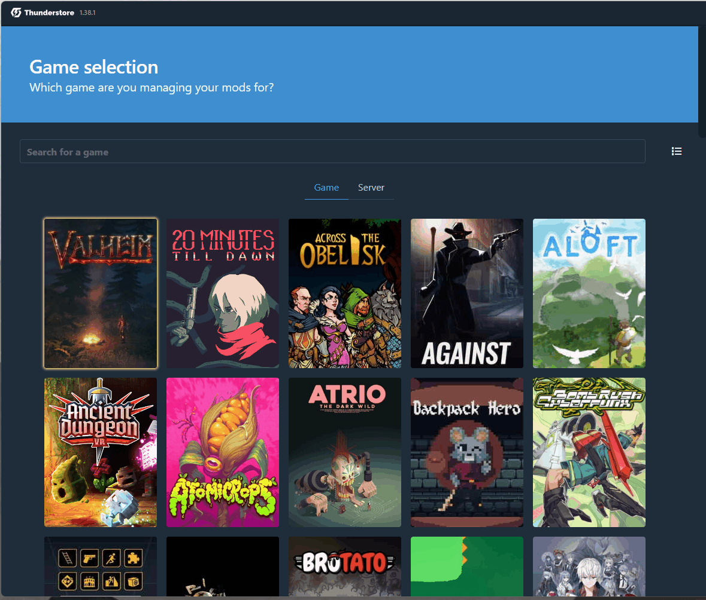

# Valheim Private

## Server Application

AGG's Private Valheim server is a community orientated, no griefing server. We've employed an application process on our Discord server, which requires you to submit an application before being able to join the game. This is to ensure you are joining for the benefit of the existing community.

The application needs to be filled correctly but it is relatively straight forward.

### Server Rules

The server rules are listed in the Discord Application thread

## Submitting an Application

To submit an application you will need to

1. Join our [Discord server](https://discord.agamersgrind.com)
2. Navigate to the Private Game Servers section and click on Application
3. Click on the Valheim Private button
4. Fill out the form

## Getting your SteamID  string

### For Steam players

Valheim's whitelisting process isn't amazing and requires whitelisting a SteamID64 string. You can find this string various ways, but I find this process works the best

1. Browse to [https://steamid.io](https://steamid.io)
2. Click on Sign in with Steam and sign into your Steam account
3. Click on your profile image in the top right, then Profile
4. Copy the number from the 'Lookup' box
5. Paste into the Discord application thread

<figure><figcaption></figcaption></figure>

### For Xbox App / Game Pass players

Unfortunately getting the SteamID64 for Game Pass players is a bit more difficult, the easiest way to get this is

1. Launch Valheim
2. Click on Start Game and select a non-modded Character, then click on Start
3. Click on Join Game and search for AGamersGrind
4. Join the public server and input the password (normally 12345)
5. Press F2
6. Locate your name in the Players tab and take note of the Steam\_xxxxxxxxxxxxx key, per below\
   .png>)
7. Post this key in the Discord Application (feel free to take a screenshot and share this instead)

## Install the Modpack

### Download Prerequisites

* Thunderstore Mod Manager: [https://www.overwolf.com/oneapp/Thunderstore-Thunderstore\_Mod\_Manager](https://www.overwolf.com/oneapp/Thunderstore-Thunderstore\_Mod\_Manager)
* Modpack: [https://files.agamersgrind.com/](https://files.agamersgrind.com/) \
  (Grab the latest Valheim Private r2z file)

### Install Thunderstore Mod Manager

1. Launch the Thunderstore mod manager exe and next through the prompts

### Import the Modpack

1. Launch Thunderstore and search for Valheim
2. Select the relevant version
3. Click on Import Profile > New > File
4. Select the modpack file

<figure><figcaption></figcaption></figure>

## Join the Server

1. Launch Thunderstore
2. Select Valheim
3. Select the Modpack, "A Gamers Grind...."
4. Click on the "▶️ Modded" button
5. Click on 'AGamersGrind' in the Quick Connect menu in the top left\
   .png>)
6. Select your Character and hit Start

_Please note: Joining a non-modded server with your modded character may break your character and/or delete your items. This is all stored client side - AGG cannot restore this data_

#### You will not be able to join the server until you have

* Provided your [SteamID64 code](valheim-private.md#getting-your-steamid-string) and
* Been whitelisted on the server by a AGG moderator
