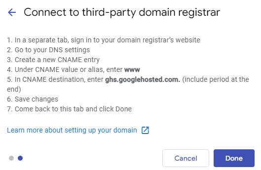

# Cloudflare Domain to Google Sites

<table data-view="cards"><thead><tr><th></th><th></th></tr></thead><tbody><tr><td>Time Required</td><td>15 Minutes</td></tr><tr><td>Difficulty</td><td>Low</td></tr></tbody></table>

## The Scenario

In this scenario, we're redirecting a domain managed by Cloudflare to a Google Site. Google Site's are great as they are free!

### Prerequisites

* A Google account
* [A website built in Google Sites](https://sites.google.com/new)
* A domain managed by Cloudflare

Domains managed by other providers can be redirected to Google sites but I don't know anything about that. If your domain is managed elsewhere, you may be able to follow some of this guide but I will not be able to assist you with troubleshooting

## Configure Google Site

Connect your domain to your Google Site

1. Click on the settings cog in the top right
2. In the menu, select Custom Domains
3. Click on Add
4. Input your domain (I recommend leaving the www as is but it is possible to host multiple websites under the same domain, using [subdomains](https://static.semrush.com/blog/uploads/media/fa/70/fa70fafcbf91927caa27d6d418d83aa1/original.png))

Domain is not verified message

1. Click on the "verify domain"
2. Click Continue on the Domain option
3. Click on Start Verification
4. A Cloudflare link will open, click on "Authorize" to add the TXT record
5. Wait a moment for Google to verify ownership of the domain
6. Return to the Google Site

You may need to backspace and retype the domain

5. Click on Next and you will be provided with the below information\
   

## Configure Cloudflare DNS

Now that the Google Site is set up to accept your domain, we need to configure the forward in Cloudflare

1. Navigate to your [Cloudflare dashboard](https://dash.cloudflare.com/) and select the relevant domain
2. On the left hand menu, select DNS
3.  Click on "Add Record", input the below and hit Save

    <figure><figcaption>
Don't forget to leave a comment down the bottom - this information is helpful when you have a lot of DNS records
</figcaption></figure>

### Bonus - Redirect the root to www

I highly recommend following this, as by default going to `mydomain.com` will not work, but `www.mydomain.com` will. In this step, we will redirect `mydomain.com` to `www.mydomain.com`

1. Navigate to your [Cloudflare dashboard](https://dash.cloudflare.com/) and select the relevant domain
2. On the left hand menu, select DNS
3.  Click on "Add Record" , input the below and hit Save\

    <figure><figcaption></figcaption></figure>
4. On the left, click on Rules > Redirect rules
5.  Create a new rule and input the below (don't forget to change the domain address for your domain, highlighted in yellow)\

    <figure><figcaption></figcaption></figure>
6. Click on Deploy

You will now need to wait some time for the rules to apply, sometimes this is very slow.

