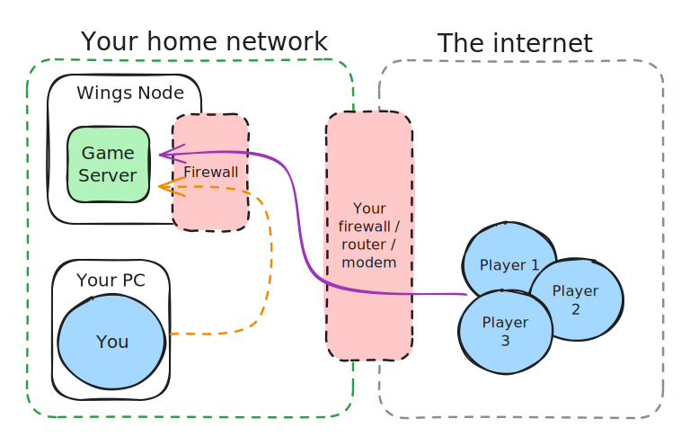

# Troubleshooting

## Can't join Game Server/s

This section is to assist with troubleshooting port forwards, firewall rules and DDNS issues.

_This guide is assuming you're hosting the server in your home network, not on a cloud host._

### Confirm there is not an DDNS issue

_You can skip troubleshooting DDNS by trying to connect to your_ [_public IP_](https://whatismyipaddress.com/) _instead_

1. Go to google and search 'what is my IP' and take note of the IP address
2. Launch `CMD` or the shell of your choice
3. Type `ping YOUR.DDNS.ADDRESS.HERE` and hit enter\
   eg `ping play.reallycoolservers.com`
4. Take note of the output and refer to the below table



<pre data-overflow="wrap"><code>C:\Users\x>ping play.reallycoolservers.com

Pinging play.reallycoolservers.com [123.123.123.123] with 32 bytes of data: 
Reply from 123.123.123.123: bytes=32 time&#x3C;1ms TTL=64 
Reply from 123.123.123.123: bytes=32 time&#x3C;1ms TTL=64 
Reply from 123.123.123.123: bytes=32 time&#x3C;1ms TTL=64 
Reply from 123.123.123.123: bytes=32 time&#x3C;1ms TTL=64

Ping statistics for 123.123.123.123: <a data-footnote-ref href="#user-content-fn-1">Packets: Sent = 4, Received = 4</a>, Lost = 0 (0% loss), Approximate round trip times in milli-seconds: Minimum = 0ms, Maximum = 0ms, Average = 0ms
</code></pre>

#### A server has responded to your pings, great!

1. Confirm that the IP address matches your Google result
   * If it matches, great! Skip to
   * If it doesn't match, there is an issue with your DDNS container. Review the logs for the container

**Continue to the next step**



<pre><code>C:\Users\x>ping play.reallycoolservers.com

<a data-footnote-ref href="#user-content-fn-2">Ping request could not find host play.reallycoolservers.com</a>. Please check the name and try again.
</code></pre>

#### Your DDNS config is incorrect OR you've made a typo in your ping command.

1. Firstly, review your ping command and ensure the address is correct
   * If it is correct, there is an issue with your DDNS container. Review the logs for that container. Feel free to refer to my existing [dynamic-dns.md](../cloudflare/dynamic-dns.md "mention") documentation
   * If you've made a typo in the address, redo the test with the correct address

**This needs to be resolved before you can continue any further**



<pre data-overflow="wrap"><code>C:\Users\x>ping play.reallycoolservers.com

Pinging play.reallycoolservers.com [123.123.123.123] with 32 bytes of data:
Request timed out.
Request timed out.
Request timed out.
Request timed out.

Ping statistics for 123.123.123.123:
    <a data-footnote-ref href="#user-content-fn-3">Packets: Sent = 4, Received = 0, Lost = 4 (100% loss),</a>
</code></pre>

#### You have resolved an IP address but the server does not respond to pings

Confirm that the resolved IP address matches your [public IP](https://whatismyipaddress.com/)

* If the IP address matches, this isn't a bad thing - some firewalls are configured to NOT respond to pings as a security measure.
* If the IP address does not match, there is something wrong with your DDNS container. Review the logs for the container. Feel free to refer to my existing [dynamic-dns.md](../cloudflare/dynamic-dns.md "mention") documentation

**This needs to be resolved before you can continue any further**



### Narrow down the issue

There are multiple areas where this can go wrong. Let's narrow it down, please refer to the below image.



The above network map should be relatively similar to your home network. We have 5 devices,

1. Wings Node
2. Your gaming PC
3. network switch (you may not have one of these)
4. firewall
5. friend's computer

_\*\*\*This network map assumes you are hosting your server in the same house / network as your personal PC_

**Our end goal is for the purple line (friends computer to pterodactyl node and back) to work.**

There are a few places that this line can fail,

1. [Connecting to the internet domain / IP (and not reaching the modem)](troubleshooting.md#1.-confirm-there-is-not-an-ddns-issue)
2. Bad port forwarding config in the modem
3. [Bad firewall config in the Pterodactyl node](creating-a-new-wings-node.md#allow-ports-through-the-firewall)
4. Bad game server installation config
5. ISP blocking port or port forwarding completely
6. Your ISP uses CGNAT

#### Option 3 is the easiest to confirm

To do this, we'll follow the orange line.

1. Get the LAN IP address for your Pterodactyl node. This is likely to start with 192.x.x.x, 10.x.x.x or 172.x.x.x
2. Connect to your game server via the internal IP:port, eg `192.168.1.20:25565`

<details>

<summary>I cannot connect to the server via local IP:PORT</summary>

1. SSH onto your Pterodactyl node
2. Disable the firewall\
   If you are using Ubuntu, the command is listed below\
   `sudo UFW disable`
3. Attempt to connect to the server via the internal IP:port

If it works, you will need to allow the port/s through the Firewall rule. [Please refer back to the documentation, this step is already outlined](creating-a-new-wings-node.md#allow-ports-through-the-firewall). You may have missed additional steps.

If this does not work,&#x20;

* the game server is not running
* you are looking at the wrong server or
* you are looking at the wrong port

Refer back to Pterodactyl Panel and check if the server is running and on what ports

</details>

<details>

<summary>I can connect to the server via local IP:PORT</summary>

Most likely your port forward or (IF you are using a domain) your Domains DNS is bad.

have your friend connect via your [public IP address](https://whatismyipaddress.com/) and server port, eg `1.2.3.4:25565`

**If your friends are connecting via IP, skip this step.** Browse to [this website](https://whatismyipaddress.com/) to get your public IP address and [ping your domain](https://www.youtube.com/watch?v=TWZMVM\_7csE). If the IP does not match, the DNS is incorrect. If so, you most likely have a dynamic DNS address - refer to [dynamic-dns.md](../cloudflare/dynamic-dns.md "mention") for a solution. Alternatively, your ISP may provide a static IP address at an additional cost.

If connecting directly to your public IP fails, confirm your port forward rule applies to the

* correct local IP
* correct port

**If it still fails to connect:**

**your ISP may be blocking port forwards.** I would suggest doing some Googling on your router / modem model to confirm your port forward rule has the correct syntax as some modems are awkward. You may have luck searching for `my modem model port forward minecraft server` but if you have no luck, you will need to ring your ISP.

**Your ISP may be using CGNAT.** You will need to contact your ISP to have this resolved. I would recommend googling `my isp name cgnat` and reading the results. Port forwarding will NEVER work behind a CGNAT without additional and complex network infrastructure.

Extra: You can use [this website](https://www.yougetsignal.com/tools/open-ports/) to test if a port is open (waiting for connections). Minecraft is a great server to test for this, as there are plenty of tools for testing things, [like this](https://mcsrvstat.us/)

</details>

## Pterodactyl Panel errors

### Error 500

Yeah its broken! Post on the Pterodactyl discord for assistance.

## Wings Errors

### FATAL: failed to configure docker environment error=Error response from daemon: Pool overlaps with other one on this address space

Wings has defaulted to a docker network range that is in-use. The easiest way to resolve this is to edit your config.yml file, per step [#upload-configuration-file-to-wings](creating-a-new-wings-node.md#upload-configuration-file-to-wings "mention")to include the below lines

```yaml
docker:
  network:
    interfaces:
      v4:
        subnet: 172.31.0.0/16
        gateway: 172.31.0.1
```

Please note: The IP range for 172 is quite small - 172.16 to 172.31. You may be able to get away with using a /24 subnet or something outside of the range. If you use something outside of the range you may run into issues accessing the internet on your wings host doing this. You could also use a different range, like 192.168 or 10.x


### Panel is unable to see Node

1. Start the Wings container if it not running
2.  Check your docker logs, you should see something similar to below

    <figure><figcaption></figcaption></figure>
3.  Open your internet browser and navigate to hostname:port, you should see the below error;

    <pre><code><strong>{"error":"The required authorization heads were not present in the request."}
    </strong></code></pre>

If you get different messages, you may not have applied the config file correctly


## Database issues

### Create a new database - An unexpected error was encountered while processing this request. please try again

Have you set the HASHID variable per [creating-a-new-panel.md](creating-a-new-panel.md "mention") documentation?&#x20;

If not, please re-read the documentaiton as you may have missed other steps too...&#x20;


### Game is unable to connect to Pterodactyl database

Try connecting via IP. This may be a docker DNS issue.

[^1]: sent 4, recieved 4. The connection is good

[^2]: Could not find host. DDNS config is bad

[^3]: Sent 4, recieved 0. Fail
