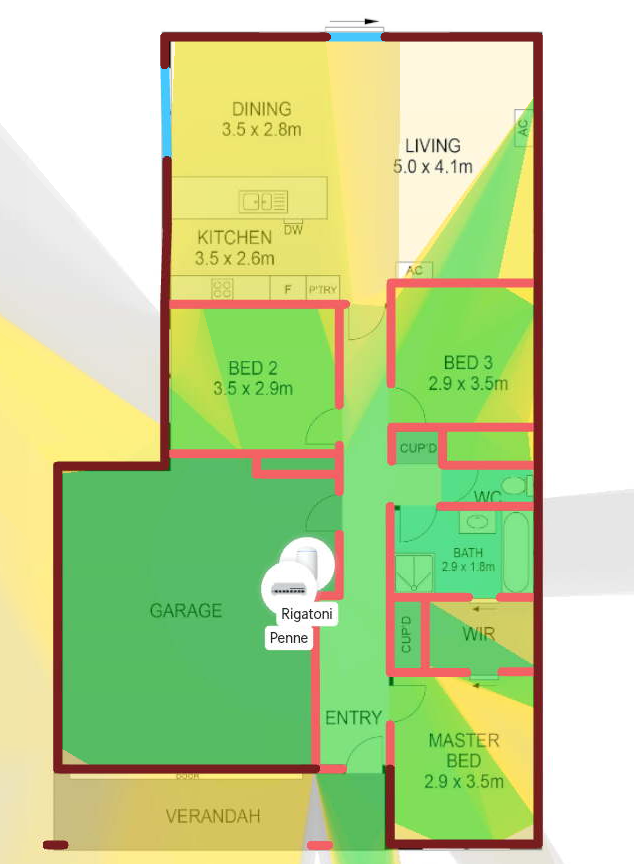

# UniFi

Part of this documentation is stored here [unifi.md](../service-overviews/infrastructure/unifi.md "mention")

## Devices

<table><thead><tr><th width="111.33333333333331">Name</th><th width="151">Type</th><th width="330">Purpose</th><th>Location</th></tr></thead><tbody><tr><td>Rigatoni</td><td>Dream Machine</td><td>Wireless, Cloudkey, Routing and Firewall</td><td>Garage</td></tr><tr><td>Penne</td><td>8p POE Switch</td><td>Core Switch</td><td>Garage</td></tr></tbody></table>

## WiFi Coverage Map

<figure><figcaption>
5Ghz Performance
</figcaption></figure>

## Network Map

